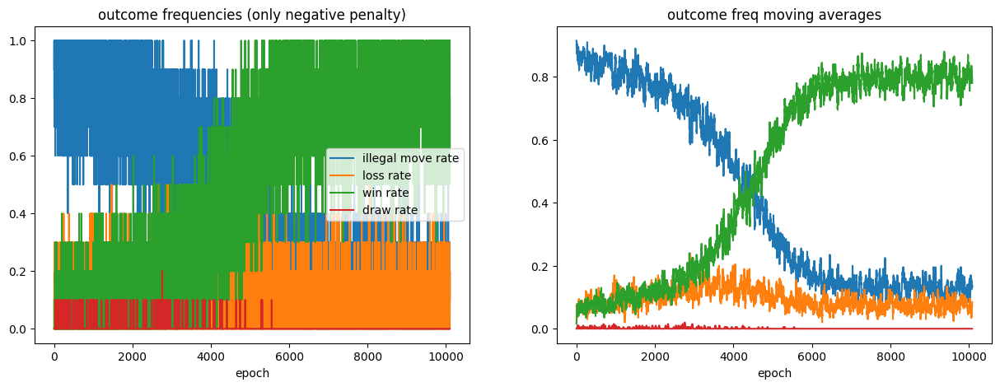

I came up with this project idea to experiment with reinforcement learning algorithms, namely vanilla policy gradient algorithms.
The tictactoe.py file contains the class definition for the "board" object representing the tictactoe board, and has class methods to place Xs and Os somewhere on the board and detect if the game is over. utils.py contain helper functions
such as gen_episode and game_step, for sampling games. rlnn.py contains the class definition for the reinforcement learning agent, containing a parametrized modeel using tensorflow
as well as training functions. The rlnn-rough.ipyn notebook contains the code I was using experimentally while testing and debugging, to hopefully demonstrate some of the codes 
usage that I didn't explain well.  

The train function returns a tuple of 4, containing the frequencies with which the agent wins, loses, draws, and *optionally*, makes an "invalid" move. I say optional because in
the agent's call function, a parameter may be passed to choose whether or not only valid moves should be sampled; I kept both options because I wanted to compare the results
of both.

Here is a learning curve I got from one of the training loops I did:

